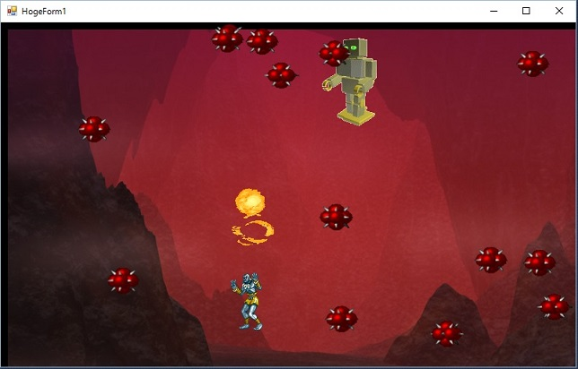

# work_VisualCSharp
Visual C# を使った、実験プログラム集です。
（※現在整理中です。少しづつアップしていきます。）

# サンプル紹介

**AniGifTest01**  
GIFアニメ画像を展開し、Windows上で展開・アニメーション表示します。  
画面表示には「Double Buffer」を使用しており、チラつきの無い画像を実現しています。  
  
スペースキーで、ヨガの人からファイアーが発射されます。  
ファイアーを当てれば当てる程、ロボは怒り狂って爆弾をまき散らすので注意。  

**AntiAliasTest**  
アンチエイリアスをかけて、ギザギザの無いシャープな図形を表示する比較実験です。  
２つのボックスが並んでおり、スライドさせて角度を変えながら、見比べる様に作っています。  

**GameSen3**  
ＵＩ画面遷移サンプルです。  
画面遷移制御処理を組込、複数画面のコントロールを切り替えています。  

**MobaTes**  
Connector/Net を使用して、C#.netからMySQLに接続します。  
（本アプリはクライアントなので、MySQLサーバーを立てる必要があります。）  

**WindowsFormsApplication1**  
名前がアレですいません。  
ラベル・テキストボックス・ボタンのシンプルなテストです。  

**PackTest**  
パックマン的なキャラを描画してパクパクとアニメーションさせるサンプルです。  
向き・速度・べた塗りOnOffを切り替える事が出来ます。  
